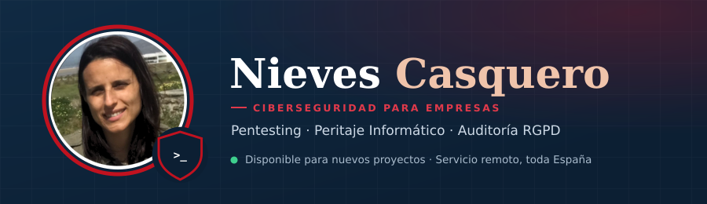

  

    

  
  
  

    

  
  
  
  

 

## Sobre mí

Especialista en **ciberseguridad ofensiva**, con base en La Línea de la Concepción (Cádiz) y disponible en remoto para toda España. Realizo auditorías de seguridad y pentesting en aplicaciones web y sistemas, además de informes periciales informáticos como **Perito Informático de Parte** (Colegiada AEPEJU). Cazadora de vulnerabilidades activa en **Bugcrowd, YesWeHack y HackerOne** — el mismo rigor técnico que aplico en cada auditoría. Organizo **CiberEstrechoCON**, comunidad de ciberseguridad del Campo de Gibraltar.

**Áreas de trabajo:**
- Pentesting y auditorías de seguridad web/infraestructura
- Peritaje informático de parte (informes con validez probatoria, RGPD)
- Bug bounty e investigación de vulnerabilidades
- Forense digital (DFIR)

 

## Certificaciones

| Certificación | Institución |
|---|---|
| Perito Informático de Parte — Colegiada AEPEJU (credencial nº 886) | AEPEJU |
| CompTIA PenTest+ | CompTIA |
| CompTIA A+ | CompTIA |
| Máster en Ciberseguridad y Hacking Ético (2026) | BIG School |

 

## Servicios de Ciberseguridad

Auditoría de ciberseguridad, pentesting, peritaje informático y cumplimiento RGPD para empresas y particulares.

  

 

## Proyectos Destacados

| Proyecto | Descripción |
|---|---|
| **[Advanced Bug Bounty Tool](https://github.com/AnkbNikas/Advanced_Bug_Bounty_Tool)** | Suite de reconocimiento y explotación para bug bounty (Nmap, Nikto, SQLmap, WPScan, API de SecurityTrails). |
| **[VulnScanner](https://github.com/AnkbNikas/VulnScanner)** | Automatización de escaneo de vulnerabilidades web con OWASP ZAP, SQLmap y Dependency-Check, con notificaciones por email. |
| **[StealthScanner](https://github.com/AnkbNikas/StealthScanner)** | Reconocimiento en Python para hacking ético, diseñado para minimizar la detección durante el escaneo. |
| **[SecuScanner](https://github.com/AnkbNikas/SecuScanner)** | Detección de vulnerabilidades básicas en Windows y Linux con registro de actividad en log. |

 

## Stack Técnico

  

  

  

 

## Estadísticas de GitHub

  

  
  

 

## Contacto

  
  

---

Credit: <a href="https://github.com/AnkbNikas">AnkbNikas</a> · Última actualización: 30/08/2026

